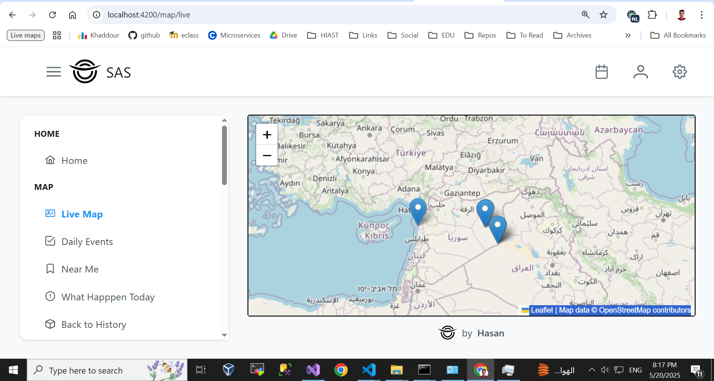

# 🛰️ Situational Awareness System (SAS) - Frontend

This is the frontend for the **Situational Awareness System (SAS)** — a geospatial platform designed to visualize and track real-world events like crimes and disasters using a map-based interface. The platform enables public users, registered users, and monitors to interact with daily and historical event data.
----



## 🌐 Live Demo

🚧 _Coming soon_

---

## 📌 Features 

### 🧭 Public (Guest) Users
- View interactive map with event markers (via Leaflet)
- Explore daily reported events
- Access landing and about pages

### 👤 Registered Users
- View historical event data
- Add comments or reviews to events
- Manage profile and account settings
- Define and update regions of interest

### 🛠️ Monitor Users
- Edit and update event details (title, location, topic)
- Assign or update event categories
- Perform administrative actions

---

## 🗂️ Project Structure (To Do)

```bash
/src/app
 ├── core/             # Global services, interceptors, guards
 ├── shared/           # Reusable UI components and pipes
 ├── features/
 │   ├── auth/         # Authentication (login, register)
 │   ├── home/         # Landing, about, daily event list
 │   ├── map/          # Leaflet-based map view
 │   ├── events/       # Event details, history, reviews
 │   ├── profile/      # User profile management
 │   ├── regions/      # Manage interest regions
 │   └── admin/        # Monitor-only functionality
 ├── app-routing.module.ts
 └── app.module.ts
